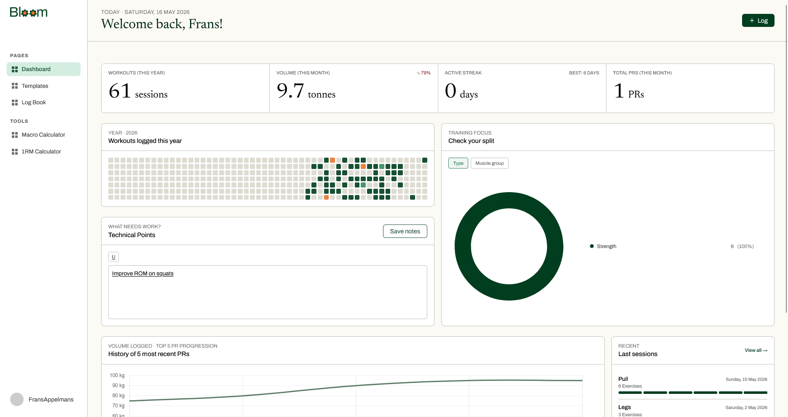
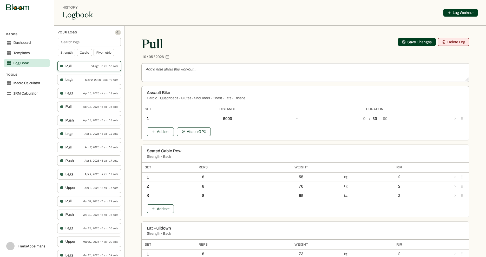
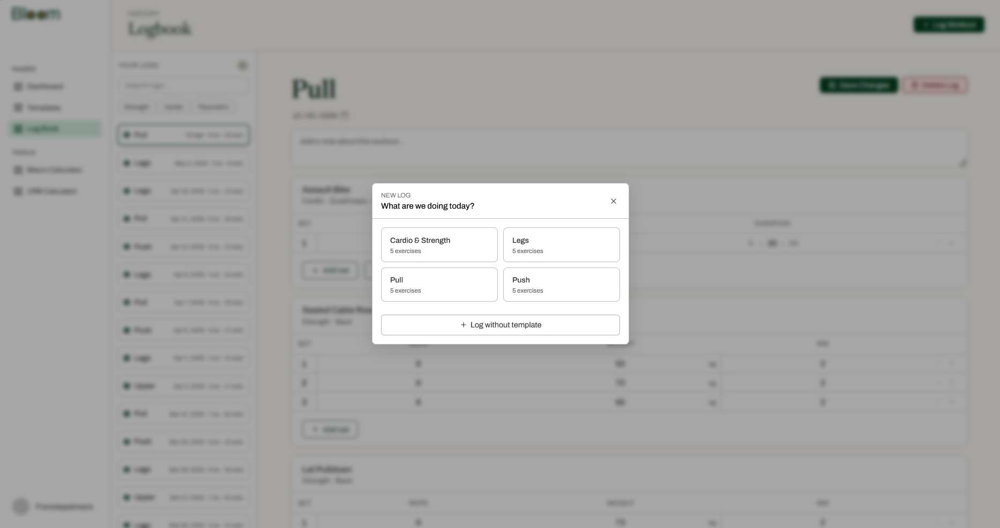
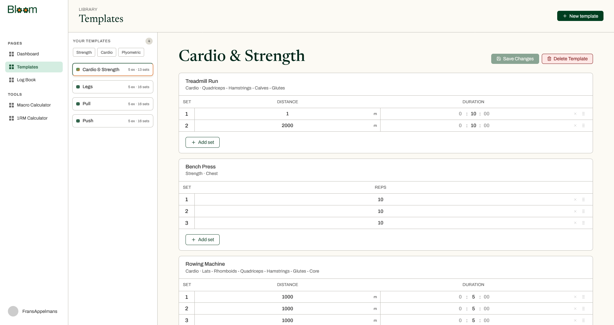
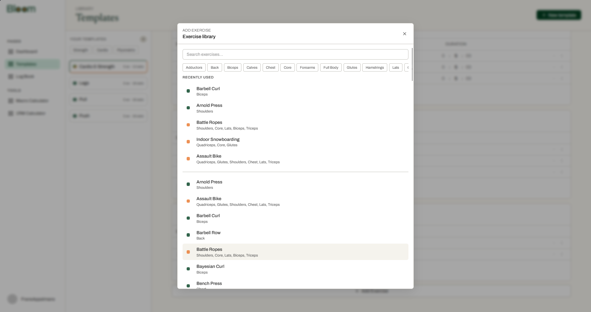
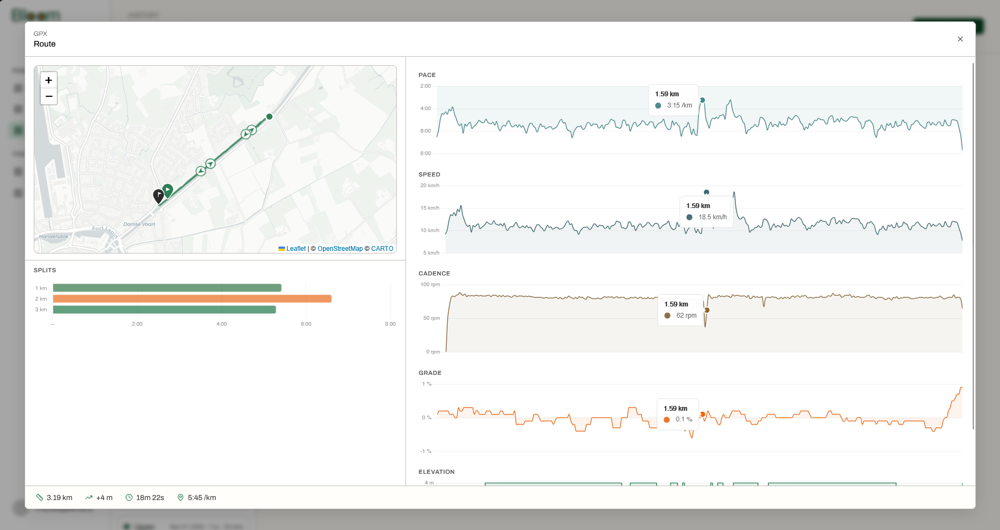

# Bloom

> Self-hosted workout tracker. Plan, log, and analyse your training — strength and cardio.

[](http://localhost:3000)
[](http://localhost:8080/scalar)
[](https://react.dev)
[](https://dotnet.microsoft.com)
[](https://www.postgresql.org)
[](https://www.docker.com)



---

## What it does

**Templates** — Build reusable routines. Set target reps, weight, and RIR for strength sets, or duration and distance for cardio. Templates load directly into a session so you are not starting from scratch every time.

**Logging** — Record actual reps and weight per set as you go. Every session is timestamped and stored in your own database.

**Analytics** — Volume trends over time, personal records by exercise, muscle group breakdown, and a 1-rep-max calculator. All derived from your own logs.

**Tools** — Macro calculator and 1RM estimator as standalone pages.

---

## Pages

| | |
|---|---|
|  |  |
| Logbook — session history | Log detail — sets and notes |
|  |  |
| Template builder | Exercise library |
|  | |
| GPX route overlay for cardio | |

---

## Stack

| Layer | Technology |
|---|---|
| Frontend | React 19 · TypeScript · Vite |
| Backend | ASP.NET Core 10 (minimal APIs) |
| Database | PostgreSQL 16 |
| Auth | JWT · bcrypt |
| Deployment | Docker Compose |

---

## Self-hosting

### Prerequisites

- [Docker](https://www.docker.com/) with Compose

### Run

```bash
git clone https://github.com/RuneHerreman/bloom-workout-tracker.git
cd bloom-workout-tracker
cp .env.example .env          # fill in JWT__Key and any other values
docker compose up --build -d
```

| Service | URL |
|---|---|
| Frontend | http://localhost:3000 |
| API | http://localhost:8080 |
| API docs (Scalar) | http://localhost:8080/scalar |

### Stop / update

```bash
docker compose down
git pull
docker compose up --build -d
```

---

## Local development

### Prerequisites

- [Docker](https://www.docker.com/) with Compose
- [.NET 10 SDK](https://dotnet.microsoft.com/download)
- [Node.js](https://nodejs.org/) (LTS)

**Backend**

```bash
# From the repo root — start only the database
docker compose up bloom-db -d

# Run the API
cd src/Bloom.Main
dotnet run --Database:ConnectionString="Host=localhost;Port=5432;Database=bloom;Username=bloom_user;Password=change_me_strong_password"
```

Replace the username and password with the values from your `.env` file. The override is required because `appsettings.Development.json` defaults to `Host=bloom-db`, which is the Docker-internal hostname and unreachable from the host machine.

**Frontend**

```bash
cd frontend/bloom
cp .env.example .env   # sets VITE_API_BASE_URL=http://localhost:8080/api/
npm install
npm run dev
```

**Tests**

```bash
dotnet test
```

---

## Migrations

If you need to recreate the migrations from scratch, delete the existing migration files and run:

```bash
dotnet ef migrations add InitialCreate \
  -p src/Bloom.Infrastructure \
  -s src/Bloom.Main \
  --context PostgresDomainDbContext \
  --output-dir Persistence/EntityFramework/Migrations/PostgreSQL
```
